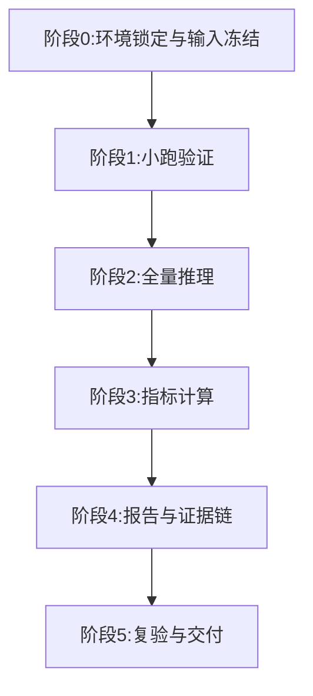

# 2026-04-12 OpenForensics 新子集 COMICS 评测系统计划（不开跑版）

## 1. 当前实测现状（已核查）

- 存储：`/root/autodl-tmp` 总 `170G`，已用 `94G`，可用 `77G`。
- GPU：`NVIDIA GeForce RTX 4080 SUPER`，显存 `32760 MiB`，空闲约 `32229 MiB`。
- 运行时：`torch 2.3.0+cu121`，`torch.cuda.is_available()=True`。
- 当前无遗留训练/评测进程（未检测到 `train.py/test.py` 相关在跑进程）。
- 关键准备资产仍完整：
  - `COMICS_Prepare`：`/root/autodl-tmp/Po/CodexDev/COMICS_Prepare`
  - OF raw：`/root/autodl-tmp/datasets/OpenForensics/zenodo_5528418/raw`
  - OF zip 索引：`/root/CodexFile_full_workspace/manifests/of_zip_index.json`（`231176` entries）
  - 初始权重：`/root/autodl-tmp/Po/CodexDev/COMICS_Prepare/weights/R-50.pkl`
  - 就绪校验：`readiness_check.json` 为通过状态

## 2. 本轮目标（计划，不执行）

- 输出检测任务报告：
  - `FAC`、`FAU`（人脸级）
  - `FCAC`、`FCAU`（帧级“完整多人脸检测”）
- 输出定位任务报告：
  - `ACC`、`IoU`、`F1`
- 在新构建 OF 数据三类子集上做性能对比：
  - 真实低光（`OF-NL`）
  - 合成低光（`OF-SL`）
  - 正常光照（`OF-Normal`）
- 给出“指标来源”与“本项目具体计算口径”。

## 3. 指标来源口径（先统一）

### 3.1 检测指标来源（论文原生）

- 参考论文：`Hu et al., ICCV 2025`（Data_015 提供）
- 论文明确给出：
  - `FAC` = face-level ACC
  - `FAU` = face-level AUC
  - `FCAC` = frame-level complete multi-face detection ACC
  - `FCAU` = frame-level complete multi-face detection AUC
- 论文说明要点：face-level 按每张人脸独立评估；frame-level 要求对该帧内所有人脸完成完整判断。

### 3.2 定位指标（项目补充口径）

- `ACC/IoU/F1` 不属于上面论文的原生四指标，需要在报告中明确标注为本项目的定位补充指标。
- 计划采用标准像素级定义（以分割掩码二值化后统计 TP/FP/FN/TN）：
  - `ACC = (TP+TN)/(TP+TN+FP+FN)`
  - `IoU = TP/(TP+FP+FN)`
  - `F1 = 2TP/(2TP+FP+FN)`
- 为避免背景像素主导，主表建议给出“人脸区域内”的定位指标；全图口径可放附录。

## 4. 子集映射与比较单元

基于现有五子集（Data_010）聚合为三大对比组：

- 真实低光（OF-NL）：`NL-CFL + NL-MFL`
- 合成低光（OF-SL）：`SL-CFL + SL-MFL`
- 正常光照（OF-Normal）：`Normal`

当前计数（来自已落盘产物）：

- `NL-CFL=387`，`NL-MFL=1833`，`NL总计=2220`
- `SL-CFL=6113`，`SL-MFL=9353`，`SL总计=15466`
- `Normal=97614`
- 总计 `115300`

## 5. 执行架构（先小跑后全量，当前不执行）

### 阶段0：环境锁定与输入冻结

- 固定输入版本：
  - 数据 manifest
  - 模型权重（初始/训练后）
  - 代码 commit hash
- 修正环境噪声项：
  - `OMP_NUM_THREADS=0` 当前会触发 `libgomp` 警告，执行时将显式改为正整数（如 4 或 8）。

### 阶段1：小跑验证（Smoke）

- 目标：验证“环境可运行 + 指标脚本可出数 + 子集映射正确”。
- 范围：抽样小规模，不做全量统计结论。

### 阶段2：全量推理

- 固定同一模型，在三大子集上统一推理。
- 优先输出 Test-Dev 口径，再补全量口径（避免数据泄露争议）。

### 阶段3：指标计算

- 检测：`FAC/FAU/FCAC/FCAU`
- 定位：`ACC/IoU/F1`
- 每个指标同时产出：
  - 分子分母原始计数
  - 置信区间/波动区间（可选 bootstrap）

### 阶段4：报告与证据链

- 主文给对比表 + 折线图 + 样例图。
- 附录给：
  - 指标定义
  - 计算脚本路径
  - 参数与版本
  - 失败样本清单

### 阶段5：复验与交付

- 复验项：
  - 子集总数闭环
  - 指标可重算
  - 图表可回溯到 CSV
- 打包交付：
  - 报告 `md/pdf`
  - `csv/json` 指标表
  - 关键可视化图

## 6. 风险与闸门（不走弯路）

1. 兼容性风险：COMICS 基线较老，`Python 3.12` 上可能出现 `detectron2/adet` 编译不兼容。  
   闸门：先小跑，失败即切换到更稳镜像/环境，不在当前环境反复试错。

2. 指标语义风险：`ACC/IoU/F1` 与 `FAC/FAU/FCAC/FCAU` 混用易引起误解。  
   闸门：报告中必须显式区分“论文原生指标”与“项目补充定位指标”。

3. 评估口径风险：全集推理易被质疑泄露。  
   闸门：主结论默认以 `Test-Dev` 展示，全集放补充。

## 7. 交付物规划（下一步执行后产出）

- `metrics_detection_{subset}.csv/json`
- `metrics_localization_{subset}.csv/json`
- `summary_compare_3subsets.csv`
- `FullReport.md`（含指标来源章节）
- `figures/*.png`（折线图、条形图、案例图）

---

状态备注：本文件为“系统计划与闸门说明”，本次未启动任何训练或推理任务。
