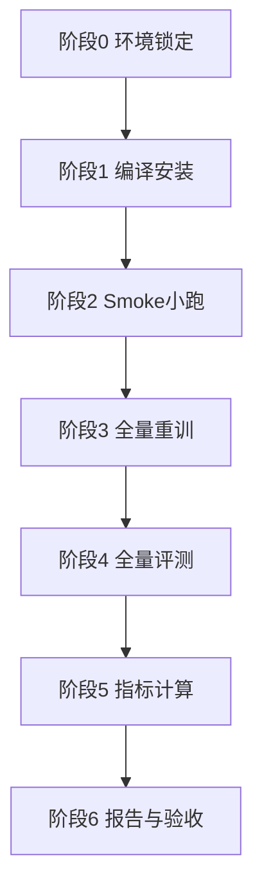

# 2026-04-13 COMICS 重训 + 评测完整执行计划（不开跑版）

## 1. 任务目标

- 用公开初始权重（`R-50.pkl`）在当前构建数据上重训 COMICS。
- 在三类子集上输出检测与定位对比结果：
  - 真实低光（OF-NL）
  - 合成低光（OF-SL）
  - 正常光照（OF-Normal）
- 报告指标：
  - 检测：`FAC/FAU/FCAC/FCAU`
  - 定位：`ACC/IoU/F1`

说明：本文件只定义执行计划与闸门，不触发任何训练/推理进程。

## 2. 当前资源状态（2026-04-13）

- 存储：`/root/autodl-tmp` 可用约 `77G`（已扩容后）。
- GPU：`RTX 4080 SUPER 32GB`，当前可见且空闲。
- 数据与准备资产：
  - `/root/autodl-tmp/Po/CodexDev/COMICS_Prepare`
  - `/root/autodl-tmp/datasets/OpenForensics/zenodo_5528418/raw`
  - `/root/CodexFile_full_workspace/manifests/of_zip_index.json`
  - `/root/autodl-tmp/Po/CodexDev/COMICS_Prepare/weights/R-50.pkl`
  - `/root/autodl-tmp/Po/CodexDev/COMICS_Prepare/manifests/readiness_check.json`

## 3. 目录与交付约定

### 3.1 代码与运行目录

- 代码根：`/root/autodl-tmp/Po/CodexDev/COMICS_Prepare/repo/COMICS`
- 启动脚本：
  - 训练：`/root/autodl-tmp/Po/CodexDev/COMICS_Prepare/scripts/10_train_comics_noextract.sh`
  - 评测：`/root/autodl-tmp/Po/CodexDev/COMICS_Prepare/scripts/11_eval_comics_noextract.sh`

### 3.2 本轮建议产物根目录

- `/root/autodl-tmp/CodexFile/Data_016_COMICS_Retrain_Eval`

建议子目录：

- `logs/`：训练评测日志
- `checkpoints/`：模型与状态快照
- `predictions/`：各子集推理结果
- `metrics/`：指标表（csv/json）
- `reports/`：报告（md）
- `graph/`：可视化图
- `manifests/`：复现清单

## 4. 执行总流程（先小跑后全量）



## 5. 分阶段计划

### 阶段0：环境锁定（必做）

目标：冻结输入，避免跑到中途口径漂移。

- 记录：
  - `nvidia-smi`
  - `python/torch/cuda` 版本
  - COMICS 代码 commit hash
  - 数据清单 hash（json/zip-index/weight sha）
- 环境修正：
  - `OMP_NUM_THREADS` 不使用 `0`，统一设为正整数（建议 `8`）。

验收门槛：

- `manifests/env_snapshot.json` 存在且字段齐全。

### 阶段1：编译安装（GPU环境）

目标：确保 `detectron2 + adet(COMICS)` 在当前镜像可用。

首选路线（同镜像）：

1. 安装基础依赖（优先本地 wheelhouse）。  
2. 安装 detectron2（与 `torch 2.3.0+cu121` 对齐）。  
3. 在 COMICS 根目录执行 `python setup.py build develop`。  
4. 做 import 探针：`detectron2` / `adet` / CUDA op。

失败回退路线（只在首选失败时）：

- 切换到稳定训练镜像（优先 `Python 3.10 + cu121` 体系），复用同一数据与脚本。

验收门槛：

- `python -c "import detectron2,adet; print('ok')"` 通过。
- 生成 `manifests/install_probe.json`。

### 阶段2：Smoke 小跑（必做）

目标：先验证流程，不直接全量。

- 小跑训练：
  - 低迭代短跑（例如 `MAX_ITER=200~500`）验证训练链路。
- 小跑评测：
  - 先跑 `Test-Dev` 小规模，确认预测文件和评估文件落盘。

验收门槛：

- 有效 checkpoint 产出（非空）。
- 至少一个 split 评测产物可解析。

### 阶段3：全量重训

目标：使用公开初始权重在当前数据上完成正式训练。

推荐命令（nohup）：

```bash
nohup bash /root/autodl-tmp/Po/CodexDev/COMICS_Prepare/scripts/10_train_comics_noextract.sh \
  > /root/autodl-tmp/CodexFile/Data_016_COMICS_Retrain_Eval/logs/train_$(date +%Y%m%d_%H%M%S).log 2>&1 &
echo $! > /root/autodl-tmp/CodexFile/Data_016_COMICS_Retrain_Eval/logs/train.pid
```

断点续跑策略：

- 使用同一 `OUTPUT_DIR` 重启，依赖 `resume_or_load(resume=True)` 自动续跑。

验收门槛：

- `model_final.pth` 产出。
- `checkpoints/train_status.json` 标记完成。

### 阶段4：全量评测

目标：固定同一训练后权重，统一评测。

顺序：

1. `Test-Dev`（主结论）  
2. `Test-Challenge`（补充）  
3. 三类子集（OF-NL/OF-SL/OF-Normal）统一推理导出

推荐命令（示例）：

```bash
OF_EVAL_SPLIT=Test-Dev bash /root/autodl-tmp/Po/CodexDev/COMICS_Prepare/scripts/11_eval_comics_noextract.sh
OF_EVAL_SPLIT=Test-Challenge bash /root/autodl-tmp/Po/CodexDev/COMICS_Prepare/scripts/11_eval_comics_noextract.sh
```

验收门槛：

- 各目标 split 均有可读预测文件与评测日志。

### 阶段5：指标计算（核心）

#### 5.1 检测指标

- `FAC`：face-level ACC（每张人脸独立）
- `FAU`：face-level AUC
- `FCAC`：frame-level complete multi-face ACC（一帧内所有人脸整体判定）
- `FCAU`：frame-level complete multi-face AUC

#### 5.2 定位指标（补充口径）

- `ACC = (TP+TN)/(TP+TN+FP+FN)`
- `IoU = TP/(TP+FP+FN)`
- `F1 = 2TP/(2TP+FP+FN)`

定位统计建议：

- 主表：人脸区域内（ROI）口径
- 附录：全图口径

验收门槛：

- 每个子集都有完整行：`FAC/FAU/FCAC/FCAU/ACC/IoU/F1`
- 同时产出分子分母计数，支持复算。

### 阶段6：报告与打包

目标：一键交付、可审计。

报告主表：

- 三子集横向对比（OF-NL / OF-SL / OF-Normal）
- Test-Dev 主结论 + Test-Challenge 补充
- 指标来源说明（论文原生 vs 项目补充）

交付包建议：

- `Data_016_COMICS_Retrain_Eval/full_delivery_bundle.zip`
- 包含：`reports/`, `metrics/`, `graph/`, `manifests/`, `key_logs/`

验收门槛：

- `acceptance_check.txt` 中 `overall_pass=true`
- 图表均可追溯到 `metrics/*.csv`

## 6. 断点续跑与失败回退

1. 训练中断：

- 保留 `OUTPUT_DIR`，同命令重启续跑。

2. 评测中断：

- 按 split 粒度重跑，不回滚已完成 split。

3. 环境编译失败：

- 记录失败日志与依赖版本；
- 触发“换镜像”回退，不在当前镜像无限重试。

## 7. 时间预算（单卡 32GB 预估）

- 阶段0~2（锁定+安装+smoke）：0.5~1 天
- 阶段3（全量训练）：1~2 天（依实际迭代）
- 阶段4~6（评测+指标+报告）：0.5~1 天

总计：约 2~4 天。

## 8. 本计划与上一版差异

- 上一版偏“评测口径规划”；本版补齐了“重训主线”。
- 新增了：
  - 训练阶段分解
  - 断点续跑机制
  - 编译失败回退路径
  - 训练到报告的完整验收门槛

---

状态：计划已定义；当前未触发训练、未触发评测。
