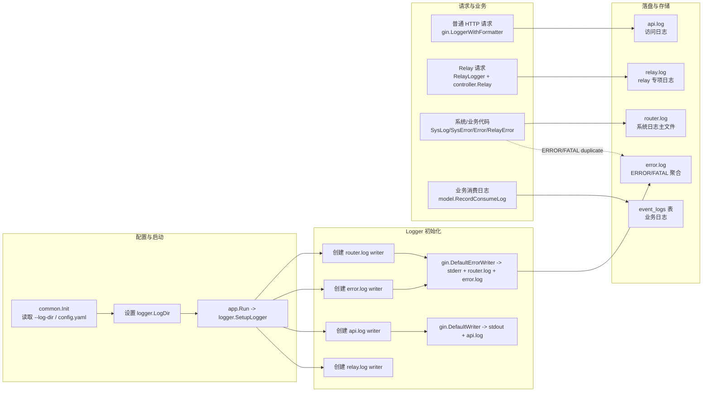
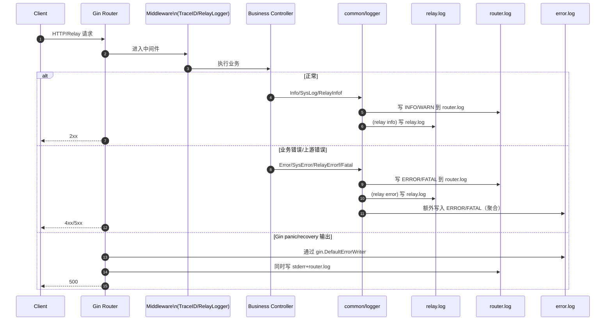
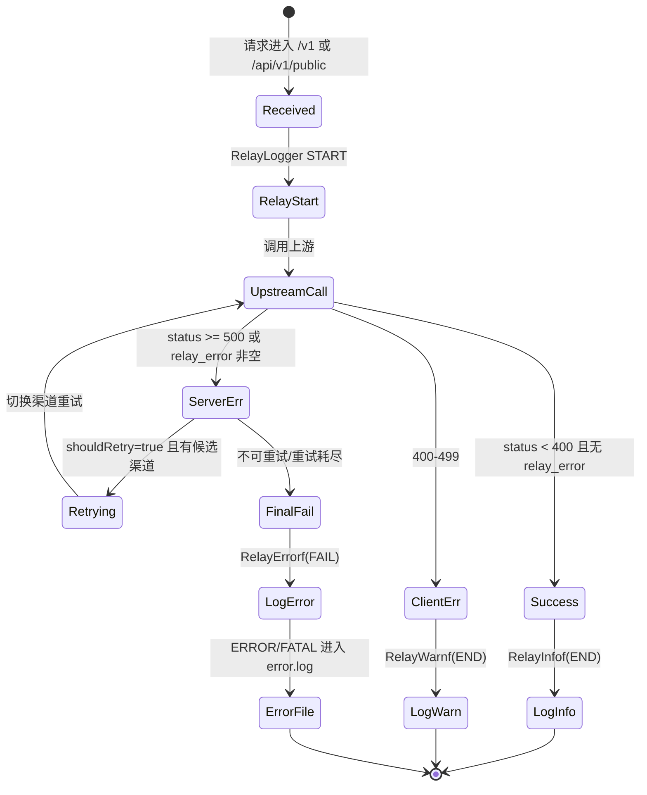
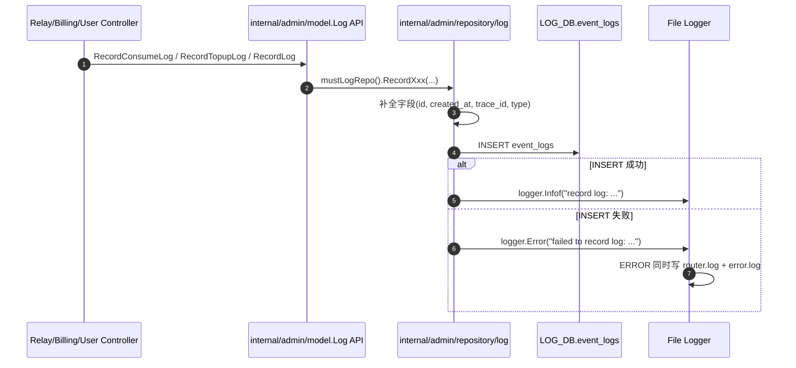

# Router 日志机制 Mermaid 图解（2026-04-13）

> 目标：帮助快速理解本仓库中“文件日志（router/api/relay/error）”与“数据库日志（event_logs）”两套体系，以及 error 级别日志进入 `error.log` 的完整链路。

## 1) 泳道图（总览）

## 2) 序列图（error.log 关键链路）

## 3) 状态图（Relay 请求与日志级别）

## 4) 序列图（event_logs 数据库日志链路）

## 结论速记

- `error.log` 不是离线筛选，而是运行时在 `ERROR/FATAL` 级别“同步额外写入”。
- `api.log` 主要承载 HTTP 访问日志；`relay.log` 承载 relay 结构化事件；`router.log` 承载通用系统日志。
- `event_logs` 是业务统计/账务维度日志（前端日志页主要读这里），与文件日志并行存在。
