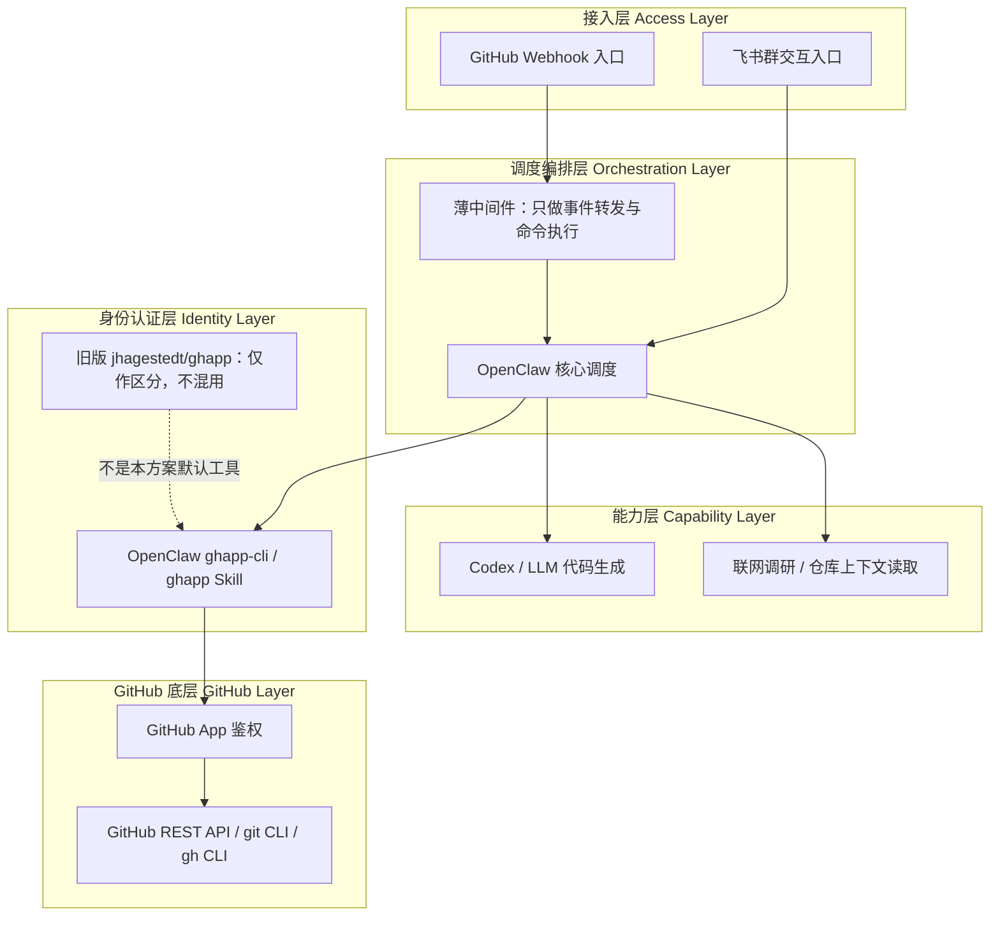

```mermaid
flowchart TB
    %% 分层泳道角色划分：架构职责解耦

    subgraph L1["接入层 Access Layer"]
        feishu["飞书群交互入口"]
        webhook["GitHub Webhook 入口"]
    end

    subgraph L2["调度编排层 Orchestration Layer"]
        openclaw["OpenClaw 核心调度"]
        middleware["薄中间件：只做事件转发与命令执行"]
    end

    subgraph L3["能力层 Capability Layer"]
        codex["Codex / LLM 代码生成"]
        context["联网调研 / 仓库上下文读取"]
    end

    subgraph L4["身份认证层 Identity Layer"]
        ghappNew["OpenClaw ghapp-cli / ghapp Skill"]
        ghappOld["旧版 jhagestedt/ghapp：仅作区分，不混用"]
    end

    subgraph L5["GitHub 底层 GitHub Layer"]
        githubApp["GitHub App 鉴权"]
        githubOps["GitHub REST API / git CLI / gh CLI"]
    end

    feishu --> openclaw
    webhook --> middleware
    middleware --> openclaw
    openclaw --> codex
    openclaw --> context
    openclaw --> ghappNew
    ghappNew --> githubApp
    githubApp --> githubOps

    ghappOld -. "不是本方案默认工具" .-> ghappNew
```
