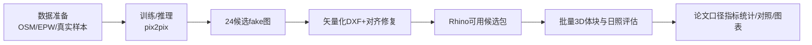

# Env 项目进展与论文复现差距（2026-04-10）

## 1) 一句话结论
- 目前已经完成 **数据→推理→24候选矢量化→Rhino可用打包** 的主链路。
- 但离“论文级复现完成”还差关键两段：**批量环境评估（Ladybug）** 与 **论文口径的结果对照/统计/图表**。
- 当前复现完成度（按论文交付标准）建议评估为 **约 55%**；按“工程链路打通”是 **约 75%**。

---

## 2) 我已实际落地的工作（含结果）

### 2.1 在 `m` 机新增并实跑自动化脚本（Phase F）
新增脚本：
- `D:\Code\Env\Ev_001_work\07_repro\scripts\phase_f_pack_batch24_for_rhino.py`
- `D:\Code\Env\Ev_001_work\07_repro\scripts\phase_f_qc_batch24.py`
- `D:\Code\Env\Ev_001_work\07_repro\scripts\phase_f_image_dedup.py`
- `D:\Code\Env\Ev_001_work\07_repro\scripts\run_rhino_batch_build.ps1`
- `D:\Code\Env\Ev_001_work\04_rhino_gh\gh_defs\scripts\rhino_batch_build_cands_template.py`
- `D:\Code\Env\Ev_001_work\04_rhino_gh\gh_defs\scripts\gh_python_mass_from_curves_template.py`
- `D:\Code\Env\Ev_001_work\07_repro\runbooks\phase_f_codefirst_batch24.md`

执行结果：
- 候选包 `24/24` 已就位：
  - `D:\Code\Env\Ev_001_work\04_rhino_gh\batch24_pipeline\07_ready_for_rhino`
- 日志已生成：
  - `...\06_logs\phase_f_ready_summary.json`
  - `...\06_logs\phase_f_qc_summary.json`
  - `...\06_logs\phase_f_fake_dedup_summary.json`

### 2.2 已核对的数据与管线状态（2026-04-10 再次快照）
来自 `phase_d2_status.py` / `phase_e_status.py`：
- 真实数据集：`accepted_samples=480`
- 分割：`train=397, val=39, test=44`
- FAR 标签：`low=229, mid=188, high=63`
- Batch24 向量化：`input=24, dxf=24, with_vectors=24`
- Phase F ready 目录：`24` 个候选目录

### 2.3 关键证据（多样性问题仍存在）
- `A_parcel_low_batch_v1/testA` 的 24 张输入，哈希唯一数仅 `7`：
  - 证据文件：`D:\Code\Env\Ev_001_work\03_ml\infer\A_parcel_low_batch_v1\meta\sha256_testA.txt`
- Phase F 的 fake 去重显示：
  - 精确重复 `0` 组，但近重复对（aHash汉明<=5）`72` 对，说明风格簇明显、有效多样性偏低。

---

## 3) 现在到底处在什么阶段

当前已完成到 `E`；`F/G` 是主要缺口。

---

## 4) 距离“论文复现完成”还有多少

## 4.1 里程碑评估
1. **数据与环境准备**：完成（100%）
2. **训练与推理产出**：基本完成（80%，因训练证据包未完整回传）
3. **候选矢量化与可导入Rhino**：完成（100%）
4. **批量体块+Ladybug全量评估**：未完成（20%）
5. **论文口径对照实验与统计图表**：未完成（10%）

**综合（论文交付口径）≈ 55%**。

## 4.2 为什么不是更高
- 你现在有 24 个候选，但还没有形成论文要的“**指标-对照-结论**”闭环。
- `03_ml/checkpoints` 与 `03_ml/logs` 当前为空；意味着在 `m` 机上缺训练可复核证据包。
- 候选多样性偏低会直接影响后续 Pareto 与论文说服力。

---

## 5) 从现在到复现完成的最短路径

### Step A（当天可做）
- 执行 Rhino 批处理（把 24 个候选自动转 `.3dm`）
- 命令：
  - `powershell -ExecutionPolicy Bypass -File D:\Code\Env\Ev_001_work\07_repro\scripts\run_rhino_batch_build.ps1`

### Step B（1~2天）
- 用 `LB_SunHours_v1.gh` + Python 模板，跑完 24 个候选的日照指标。
- 输出统一 CSV：`cand_id, footprint, gfa, FAR, sun_hours`。

### Step C（1天）
- 按论文口径生成：
  - 全量排序
  - Top-K 展示
  - 与基线（输入地块/已有方案）对照图表

### Step D（并行优化，建议）
- 修复低多样性：对 `testA` 做去重与增强后再推理一轮，减少候选“同质化”。

---

## 6) 你最关心的现实判断
- **不是卡死**：主链路已经打通，且候选包已可继续 Rhino/Ladybug。
- **也还没收官**：当前还不能说“论文复现完成”，因为核心实验统计段没跑完。
- **最关键下一步**：马上把 24 候选的环境评估批量跑完；这一步完成后，项目会从“工程可用”进入“论文可交付”。

